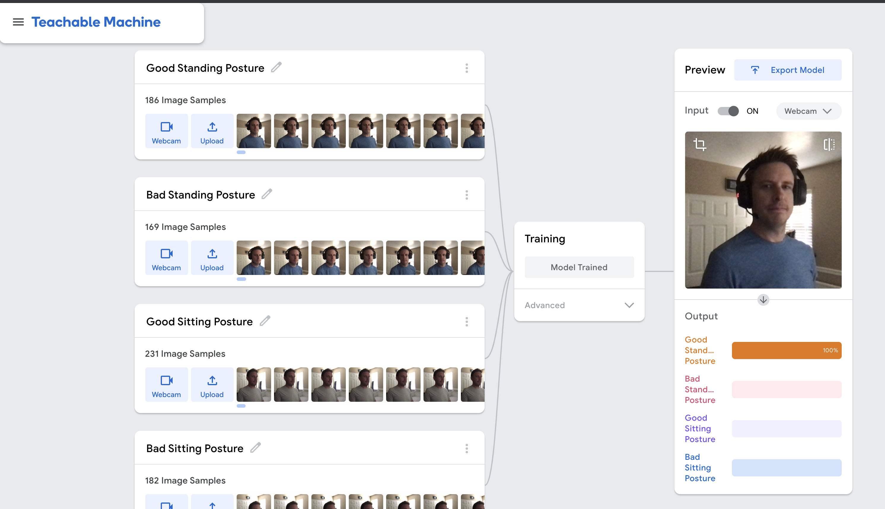

# slouchcop

An ML-powered posture detector.

Note: this project is highly experimental and just a proof-of-concept. ML models in this project are trained on specific humans, and may not work for you.

## Example - dave standing/sitting

Use [teachable machine](https://teachablemachine.withgoogle.com/) to generate a model with four classifications:

* Good Standing Posture
* Bad Standing Posture
* Good Sitting Posture
* Bad Sitting Posture



```
cd /examples/dave-standing-sitting
./run
open localhost:8081
```

